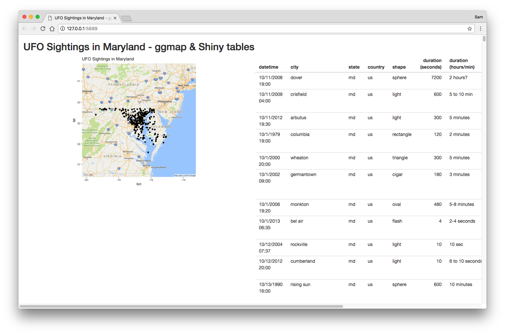

# UFO Sightings in Maryland

## App Versions

To access these apps, `git clone` this repository. Each version lives in a separate branch

### ggmap version

`ggmap` branch - `git checkout ggmap`

### leaflet version

`leaflet` branch - `git checkout leaflet`

## Documentation

### Adding DataTables

RStudio page for integrating DataTables:

* [RStudio DataTables Documentation](https://rstudio.github.io/DT/)
* [Shiny-specific Documentation](https://rstudio.github.io/DT/shiny.html)
* [Tons of customization options](https://rstudio.github.io/DT/options.html)
* [Full DT Documentation from JS Library](https://datatables.net/reference/index)

### Adding Leaflet

Check out the RStudio page for integrating Leaflet:

* [RStudio Leaflet Documentation](https://rstudio.github.io/leaflet/)
* [Shiny-specific Documentation](https://rstudio.github.io/leaflet/shiny.html)

---

## Data

Dataset retrieved from Kaggle: https://www.kaggle.com/NUFORC/ufo-sightings/data
